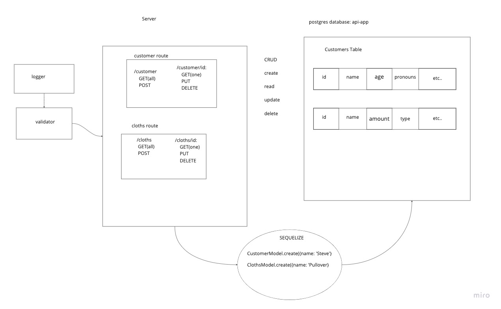

# LAB - Class 03

## Project: Basic API Server

### Author: Steven Rejdukowski

### Problem Domain

Build a REST API using Express, by creating a proper series of endpoints that perform CRUD operations on a database, using the REST standard

### Links and Resources

- [ci/cd](https://github.com/Stevenrej/basic-api-server/actions/new) (GitHub Actions)
- [prod deployment](https://basic-api-server-prod-pduk.onrender.com/)

### Setup

#### `.env` requirements (where applicable)

see `.env.sample`

- PORT: 3001

- DATABASE_URL=postgres://localhost:5432/api-app

#### How to initialize/run your application (where applicable)

- nodemon

#### Features / Routes

- Feature One: Cloths Database
- GET : `/cloths`
- GET : `/cloths/id:`
- POST: `/cloths`
- PUT : `/cloths/id:`
- DELETE : `/cloths/id:`

- Feature Two: Customer Database
- GET : `/customer`
- GET : `/cusomer/id:`
- POST: `/customer`
- PUT : `/customer/id:`
- DELETE : `/customer/id:`

#### Tests

- How do you run tests?
npm test
- Any tests of note?
- handles root path
- handles invalid requests
- hanldes errors
- handles GET requests
- Handles POST requests
- handles PUT requests
- handles DELETE requests

#### UML

